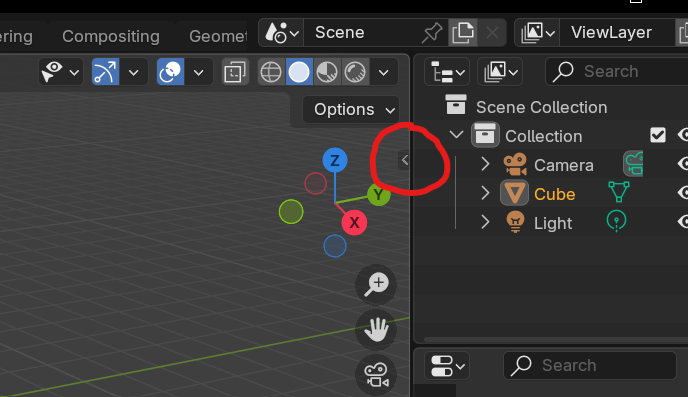
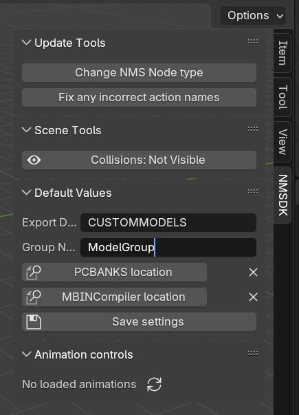

# NMS Custom Model Importer (NMSDK)

NMSDK is a blender plugin designed to allow models to be added to No Man's Sky, as well as to load models from the games' data.

For full documentation such as installation instructions, API details and details on various functions see the NMSDK website here: https://monkeyman192.github.io/NMSDK/

## Looking for an older version?

Thanks to [Rayrod](https://github.com/RaYRoD-TV)'s contribution, there is a branch of NMSDK just for the pathfinder version of NMS and below. It can be found at this branch: https://github.com/monkeyman192/NMSDK/tree/pathfinder
NOTE: The following readme does not apply for these old versions, please follow any instructions for the particular version you are looking at.

### Installing NMSDK

#### Install as zip add-on

Installing NMSDK is very easy. Head to the [NMSDK Release page](https://github.com/monkeyman192/NMSDK/releases) on GitHub and download the most recently released version.

Open Blender and open the preferences popup (`Ctrl` + `,`) (or `Edit` > `User Preferences...`), and select `Add-ons` (on the left hand side).
At the top right corder of this window is a `⋁` symbol next to the tag icon. Click this then click the option to "Install from disk...".
Select the `.zip` file you just downloaded and blender should install it without any errors.

To make exporting easier, NMSDK will automatically convert all produced `.mxml` files to `.mbin` files. For this to work, [MBINCompiler](https://github.com/monkeyman192/MBINCompiler) is required. See below for instructions on downloading and installing the latest version.

#### Install as a Script directory

This method is useful if you are comfortable with git. It has the added benefit that if you update blender you do not need to re-add the plugin.

First, create a directory somewhere (such as your documents folder) and call it "Blender Addons". Inside this directory create another folder called "addons".
Inside this directory clone the NSMDK github repo. This can be done directly via the command line (`git clone https://github.com/monkeyman192/NMSDK.git`), or by unpacking the contents of the release zip into this `addons` folder.

The final folder structure should look something like:
`(documents folder) > Blender Addons > addons > nmsdk > (multiple sub-directories and files)`

Once this is done, open blender and open the preferences popup (`ctrl` + `,`) (or `Edit` > `User Preferences...`).
One the left-hand side, select the "File Paths" option, and near the bottom is the "Script Directories" section.
Select and add the "Blender Addons" directory (not one of the child directories). When you select the folder it will open it, but DO NOT select the "addons" directory inside it. It must be this parent directory.

Once this is done you should see the NMSDK plugin having been added to blender (can confirm by looking under the "Add-ons" section).

---

### Prerequisites

#### Blender

NMSDK requires a version of Blender greater than or equal to 4.2

#### MBINCompiler

For NMSDK to work, it requires [MBINCompiler](https://github.com/monkeyman192/MBINCompiler) to generate the *.mbin* files that are read by the game.
If you already have a version of *MBINCompiler* on your computer, ensure it is the latest version. This can be found on the [MBINCompiler releases](https://github.com/monkeyman192/MBINCompiler/releases) page.

To configure NSMDK to use the correct *MBINCompiler* version, open the Blender and then open the settings toolbox by clicking the small `<` in the main window as shown in the image below:

Select the `NMSDK` option on the right side of the panel that pops out and you should see something like this:

To have the best experience, it's recommended that you specify the `PCBANKS location` as well as the `MBINCompiler location`.

The `PCBANKS location` is the folder which contains the unpacked files for the game. This is used as a fallback so that NMSDK knows where to search for any files it can't find in a local directory if importing in this way.

The `MBINCompiler location` is the path to the *MBINCompiler* binary that was downloaded from github to match the version of the game you are importing/exporting models for.

---

### Usage

For a comprehensive guide on using NMSDK, please visit the [documentation](https://monkeyman192.github.io/NMSDK/) for more details.

### Credits

 - Primarily coded and maintained by monkeyman192.
 - Original functionality for extracting data from blender provided by Gregkwaste.
 - Thanks to GmrLeon for their assistance in converting structs to python for the entity construction.
 - And big thanks to MsrSgtShooterPerson for the fantastic banner!
 - Thanks to everyone in the [NMS Modding discord](https://discord.gg/22ZAU9H) who has helped bug fix.
