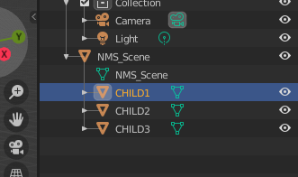
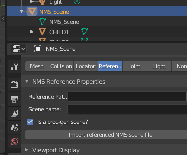
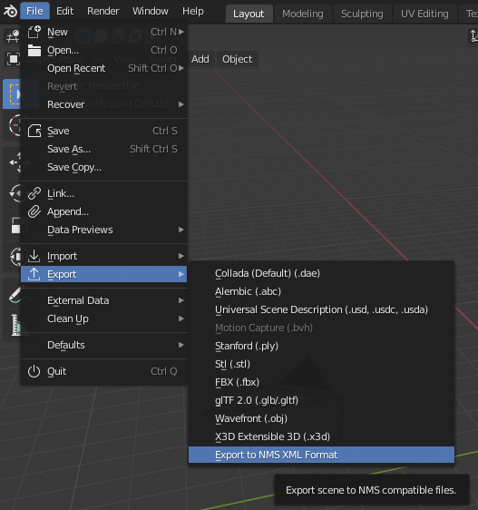

# Creating a simple proc-gen scene.

### Scenario

You have a number of objects which you wish to bundle together in a way that the game will select randomly. Either to implement new obejcts, or to add objects to an existing proc-gen pool.

### Steps

1. First, we will start by creating an empty scene in blender with NMSDK
> 

2. Right click on the object (in 'Object' mode) and select the option to add a new child.
   *NOTE*: It is important to do it this way and not create a new child naively and parent it as there may be issues here. NMS uses a different coordinate system to blender, so the process of adding a new child via the NMSDK specific context menu items means that it will be added with the correct reference frame.
> 

3. Let's add 3 child reference nodes and give them names:
> 

4. Each reference node can be given a reference path to the model you wish to reference.
    If you specify a path which is relative to a PCBANKS folder this will automatically be picked up on export. It doesn't matter if the full path itself is included.
    You can however also just copy the path the SCENE.MBIN file you want to reference and it will be used as is.
> 
> 

5. To make a scene proc-gen we will select the button 'Is a proc-gen scene?' in the root NMS_SCENE object reference properties:
> 

6. Now, all the child nodes will have a new panel which we can edit.
> 

    We are going to want to set this for every child reference node that we want to be displayed in a proc-gen way.
    Let's say we want `CHILD1` and `CHILD2` to be picked randomly but `CHILD3` to always be selected, we only need to give the first 2 a proc-prefix and the descriptor will be created in such a way that this is the behaviour.
    *NOTE*: The prefix doesn't really matter, it is just used to indicate what objects belong to the same proc-gen pool. If you give everything a different prefix, they will all be picked as each prefix pool contains only one node.

7. Export the scene
> 

    Enter a name for the scene and click export. You will see the descriptor and scene files produced in the specified directory.
